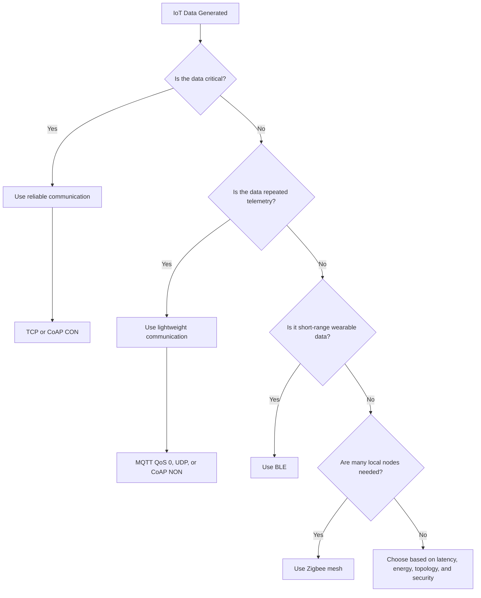

# Low-Power IoT Communication: From Protocol Choice to System-Level Energy Design

## How IoT Systems Stay Connected While Minimizing Energy Consumption

| Item | Description |
|---|---|
| Course | Computer Networks |
| Team | Group 5 |
| Topic | Low-Power IoT Communication |
| Student | Gyuri Park |
| Student ID | 2024270637 |
| Presentation Video | [Watch Here](PASTE_VIDEO_LINK_HERE) |

---

## Executive Summary

Low-power IoT communication is not solved by choosing one lightweight protocol.
Instead, it should be understood as a layered design strategy that combines communication scheduling, protocol selection, data movement reduction, and hardware-level power optimization.

In short:

> **Send only the necessary data, at the necessary time, using the most efficient communication path.**

---

## Table of Contents

1. [Problem Statement](#1-problem-statement)
2. [Why This Problem Is Hard](#2-why-this-problem-is-hard)
3. [Solution Approach](#3-solution-approach)
4. [Communication-Level Solutions](#4-communication-level-solutions)
5. [Protocol-Level Trade-offs](#5-protocol-level-trade-offs)
6. [System-Level Optimization: Reducing Data Movement](#6-system-level-optimization-reducing-data-movement)
7. [Hardware Support for Low-Power IoT](#7-hardware-support-for-low-power-iot)
8. [Trade-offs](#8-trade-offs)
9. [Decision Framework](#9-decision-framework)
10. [Logical Deductions](#10-logical-deductions)
11. [Conclusion](#11-conclusion)
12. [References](#12-references)

---

## 1. Problem Statement

IoT devices are different from ordinary computers.
They are usually small, battery-powered, widely distributed, and expected to operate for months or years without frequent charging or maintenance.

Examples include:

| IoT Device         | Main Challenge                        |
| ------------------ | ------------------------------------- |
| Temperature sensor | Periodic sensing with limited battery |
| Wearable device    | Small battery and frequent updates    |
| Smart meter        | Long-term field operation             |
| Industrial sensor  | Difficult maintenance and replacement |

The central question of this project is:

> **How can an IoT system stay connected while using as little energy as possible?**

This problem is important because IoT systems must maintain network connectivity while minimizing battery usage.
If the system communicates too often or uses protocols with unnecessary overhead, the battery can drain quickly.
However, if the system reduces communication too aggressively, it may suffer from high latency, unreliable data delivery, or poor monitoring quality.

Therefore, low-power IoT communication should be treated as a system-level design problem rather than a simple protocol selection problem.

---

## 2. Why This Problem Is Hard

Low-power IoT design is difficult because energy is consumed in several different parts of the system.

### 2.1 Wireless Communication

Wireless communication is one of the largest energy-consuming operations in IoT devices.

Energy is spent when the device:

* Wakes up the radio
* Transmits packets
* Waits for acknowledgements
* Retransmits lost packets
* Maintains a connection

For example, a temperature sensor may send only a few bytes of data.
However, if it wakes the radio too frequently, the battery can still drain quickly.

### 2.2 CPU Computation

The CPU also consumes energy when it performs tasks such as:

* Sensor data processing
* Encryption
* Control logic
* Application-level computation

Even if the communication protocol is lightweight, unnecessary computation can increase total power consumption.

### 2.3 Data Movement

Data movement is a hidden energy cost.

In many systems, data repeatedly moves between the CPU, memory, buffers, and storage.

```text
CPU ↔ Memory ↔ Buffer ↔ Storage
```

This repeated movement increases both latency and energy consumption.

Therefore, reducing packet size alone is not enough.
A low-power IoT system should also reduce unnecessary internal data movement.

---

## 3. Solution Approach

The goal of low-power IoT communication is not to remove communication completely.
The real goal is to communicate only when communication is useful.

The solution approach can be summarized as follows:

```text
Send less data → Sleep more often → Move less data
```

| Principle        | Meaning                                          | Energy Benefit                   |
| ---------------- | ------------------------------------------------ | -------------------------------- |
| Send less data   | Reduce unnecessary packets and protocol overhead | Less radio activity              |
| Sleep more often | Keep the radio and CPU inactive when possible    | Lower active power consumption   |
| Move less data   | Reduce CPU-memory traffic and buffer copies      | Lower internal processing energy |

This leads to one important design rule:

> **The communication method should be selected based on the importance of the data.**

For example, routine temperature readings are repeated over time and can often tolerate occasional packet loss.
Therefore, lightweight communication may be acceptable.

However, fire alarms, smoke detection, and control commands are critical.
For this type of data, reliable communication should be used even if it increases overhead.

---

## 4. Communication-Level Solutions

### 4.1 Duty Cycling

Duty cycling is a low-power technique where an IoT device alternates between active and sleep states.

For example:

```text
Active for 1 second → Sleep for 9 seconds → Active for 1 second → Sleep for 9 seconds
```

In this case, the device is active only 10% of the time and sleeps 90% of the time.

This saves energy because the radio and CPU are not active continuously.

#### Duty Cycle Example

```mermaid
gantt
    title Duty Cycling Example: 1 Second Active + 9 Seconds Sleep
    dateFormat  X
    axisFormat %s
    section IoT Device State
    Active     :active1, 0, 1
    Sleep      :sleep1, 1, 9
    Active     :active2, 10, 1
    Sleep      :sleep2, 11, 9
    Active     :active3, 20, 1
    Sleep      :sleep3, 21, 9
```



### 4.2 Periodic Communication

In periodic communication, a device sends data at fixed intervals.

Example:

```text
A temperature sensor sends data every 10 seconds.
```

This approach is simple and predictable.
However, it can waste energy if the device sends data even when the measured value has not changed.

### 4.3 Event-Driven Communication

In event-driven communication, a device remains quiet until a meaningful event occurs.

Example:

```text
A fire sensor sends data only when abnormal smoke or temperature is detected.
```

This method reduces unnecessary transmission and can save more energy than periodic communication.

### 4.4 Trade-off of Communication Scheduling

Duty cycling and event-driven communication reduce energy consumption, but they also introduce trade-offs.

| Benefit                  | Trade-off                         |
| ------------------------ | --------------------------------- |
| Lower energy consumption | Higher latency                    |
| Longer battery life      | Lower monitoring resolution       |
| Less network traffic     | Possible delay in event detection |

Therefore, communication scheduling must balance energy savings and application requirements.

---

## 5. Protocol-Level Trade-offs

There is no single best protocol for all IoT systems.
The best choice depends on reliability, latency, energy consumption, topology, range, and security requirements.

### 5.1 TCP vs UDP

TCP and UDP show a clear reliability-energy trade-off.

| Feature     | TCP                                          | UDP                   |
| ----------- | -------------------------------------------- | --------------------- |
| Connection  | Connection-oriented                          | Connectionless        |
| Reliability | High reliability with ACK and retransmission | No delivery guarantee |
| Overhead    | Higher                                       | Lower                 |
| Latency     | Higher                                       | Lower                 |
| Energy cost | Higher                                       | Lower                 |

TCP is suitable for critical data because it provides reliable delivery.
However, this reliability requires additional overhead.

UDP is suitable for routine sensor data because it is lightweight and has low latency.
However, UDP does not guarantee delivery or ordering.

The key question is not simply:

```text
Should we use TCP or UDP?
```

The better question is:

```text
Which data requires reliability, and which data can tolerate loss?
```

### 5.2 MQTT

MQTT is a lightweight publish/subscribe protocol commonly used in IoT telemetry.

Basic structure:

```text
Sensor / Publisher → MQTT Broker → Subscriber / Cloud Application
```

MQTT is useful because publishers and subscribers do not communicate directly.
Instead, the broker receives messages and forwards them to the appropriate subscribers.

MQTT also supports QoS levels.

| QoS Level | Meaning       | Overhead |
| --------- | ------------- | -------- |
| QoS 0     | At most once  | Lowest   |
| QoS 1     | At least once | Medium   |
| QoS 2     | Exactly once  | Highest  |

MQTT is suitable for cloud-connected sensor reporting and repeated telemetry.

### 5.3 CoAP

CoAP is designed for constrained IoT environments.
It runs over UDP and adds optional reliability at the application layer.

CoAP supports two important message types.

| Message Type | Meaning                     | Suitable Case                     |
| ------------ | --------------------------- | --------------------------------- |
| NON          | No acknowledgement required | Routine sensor reading            |
| CON          | Acknowledgement required    | Critical alarm or control command |

The key idea of CoAP is selective reliability.

> **Do not pay the reliability cost for every packet. Use reliability only when the data requires it.**

This makes CoAP useful for low-power IoT because it keeps the lightweight nature of UDP while allowing reliability when necessary.

### 5.4 BLE and Zigbee

Transport and application protocols are only part of the design.
Wireless access technology also affects battery life.

| Technology | Strength                                 | Suitable Example                |
| ---------- | ---------------------------------------- | ------------------------------- |
| BLE        | Very low-power short-range communication | Heart-rate sensor to smartphone |
| Zigbee     | Low-power mesh networking                | Smart-home room sensors         |

BLE is suitable for nearby personal-area communication.
Zigbee is suitable when many low-power nodes need local mesh connectivity.

---

## 6. System-Level Optimization: Reducing Data Movement

Even if wireless communication is optimized, internal data movement can still waste energy.

In a conventional system, data often moves repeatedly between the CPU and memory.

```text
CPU ↔ Memory
```

This repeated CPU-memory transfer causes delay and energy waste.

One possible solution is PIM, or Processing-In-Memory.
PIM moves computation closer to where the data is stored.

```text
Memory + Near-Data Computing
```

This reduces unnecessary CPU-memory traffic.

For IoT devices, this is important because many systems repeatedly process small sensor values or buffers.
Reducing internal data movement can lower both energy consumption and processing delay.

A PIM-based VR application case study also discusses task partitioning methods for minimizing data communication in a Processor-in-Memory environment.
This supports the argument that reducing data movement is an important system-level strategy for improving energy efficiency.

---

## 7. Hardware Support for Low-Power IoT

Protocol selection reduces network overhead, but hardware-level techniques are also necessary for low-power design.

### 7.1 Clock Gating

Clock gating stops clock signals to unused circuit blocks.

This reduces dynamic power consumption because inactive blocks do not continue switching unnecessarily.

Clock gating is also related to machine-learning-based design quality prediction research, which attempts to improve power optimization decisions during hardware design.
This supports the idea that low-power IoT design can be improved not only through protocol selection but also through intelligent hardware-level optimization.

### 7.2 Power Gating

Power gating turns off unused circuit blocks completely.

This reduces leakage power, which is important when a device spends a long time in sleep mode.

### 7.3 PIM / Near-Memory Computing

PIM reduces data movement by processing data closer to memory.

This helps reduce:

* CPU-memory traffic
* Processing delay
* Energy consumption

The layered structure of low-power IoT design can be summarized as follows:

```text
Application Layer → Transport Layer → Wireless Layer → Hardware Layer
MQTT / CoAP       → TCP / UDP       → BLE / Zigbee   → Gating / PIM
```

This shows that low-power IoT communication cannot be solved by one layer alone.
Communication, computation, wireless access, and hardware must work together.

---

## 8. Trade-offs

Low-power IoT design always involves trade-offs.
Reducing energy consumption often means that the system must sacrifice latency, reliability, monitoring resolution, or design simplicity.

| Design Choice               | Benefit                                  | Trade-off                                                   |
| --------------------------- | ---------------------------------------- | ----------------------------------------------------------- |
| Duty Cycling                | Reduces active radio and CPU time        | May increase latency because the device sleeps periodically |
| Event-driven Communication  | Avoids unnecessary periodic transmission | May miss small changes or reduce monitoring resolution      |
| UDP / CoAP NON              | Low overhead and low energy consumption  | No guaranteed delivery                                      |
| TCP / CoAP CON              | Higher reliability for critical data     | More ACKs, retransmissions, and protocol overhead           |
| MQTT QoS 0                  | Lightweight telemetry transmission       | Message delivery is not guaranteed                          |
| MQTT QoS 1 / QoS 2          | Better delivery guarantee                | Higher communication overhead                               |
| BLE                         | Very low-power short-range communication | Limited range and topology                                  |
| Zigbee                      | Supports low-power mesh networking       | Requires network coordination and routing overhead          |
| PIM / Near-Memory Computing | Reduces CPU-memory data movement         | Requires specialized hardware support                       |
| Clock Gating / Power Gating | Reduces dynamic and leakage power        | Increases hardware design complexity                        |

These trade-offs show that low-power IoT communication is not about always choosing the lowest-energy option.
Instead, the system should match energy cost to data importance.

---

## 9. Decision Framework

A practical IoT system should select communication methods according to data type and system constraints.

| Scenario                | Example Data                            | Primary Requirement      | Suitable Choice            |
| ----------------------- | --------------------------------------- | ------------------------ | -------------------------- |
| Periodic telemetry      | Temperature / humidity                  | Low overhead             | MQTT or UDP / CoAP NON     |
| Critical alarm          | Fire, smoke, intrusion, control command | Reliability              | TCP or CoAP CON            |
| Nearby wearable sensor  | Heart-rate or motion data               | Very low power           | BLE                        |
| Many local sensor nodes | Room sensors connected to local hub     | Mesh scalability         | Zigbee                     |
| Security-sensitive data | Health data or control messages         | Protection and integrity | TLS / DTLS or secure layer |

The main answer is:

> **Low-power design is a selection strategy, not a single protocol choice.**

### Decision Flow



---

## 10. Logical Deductions

From the analysis, the following logical deductions can be made.

### Deduction 1: Reliability should depend on data importance.

Routine sensor data, such as temperature or humidity, is usually repeated over time.
If one packet is lost, the next packet can still provide updated information.
Therefore, lightweight communication such as UDP or CoAP NON can be acceptable.

However, critical data such as fire alarms, smoke detection, or control commands cannot tolerate loss.
Therefore, reliable communication such as TCP or CoAP CON should be used even though it increases overhead.

### Deduction 2: Reducing wake-up frequency can be more important than reducing packet size.

Even if each packet is small, frequent radio wake-ups consume energy.
Therefore, duty cycling and event-driven communication are important because they reduce the amount of time that the radio and CPU remain active.

### Deduction 3: Protocol optimization alone is not enough.

Wireless communication is not the only source of energy consumption.
CPU computation and CPU-memory data movement also consume energy.
Therefore, PIM, clock gating, and power gating should be considered together with protocol selection.

### Deduction 4: The best low-power design is scenario-dependent.

A wearable sensor, a fire alarm, and a smart-home mesh network have different requirements.
Therefore, the best design depends on reliability, latency, energy, topology, range, and security requirements.

### Deduction 5: Low-power design should balance energy cost and data value.

If the system always chooses the most reliable method, it wastes energy on non-critical data.
If the system always chooses the lightest method, it may fail to deliver critical data.

Therefore, a low-power IoT system should match the communication cost to the importance of the data.

---

## 11. Conclusion

Low-power IoT communication is about matching energy cost to data value.

The most important design principles are:

1. Communicate only when useful.
2. Select protocols according to data importance.
3. Reduce unnecessary packet transmission.
4. Reduce internal data movement.
5. Use hardware-level power-saving techniques when possible.
6. Optimize the entire system, not only the network protocol.

Final message:

> **Low-power IoT communication is not a single protocol choice, but a layered selection strategy that balances energy, reliability, latency, and system complexity.**

---

## 12. References

1. IETF, RFC 768: User Datagram Protocol.
   https://datatracker.ietf.org/doc/html/rfc768

2. IETF, RFC 9293: Transmission Control Protocol.
   https://datatracker.ietf.org/doc/html/rfc9293

3. IETF, RFC 7252: The Constrained Application Protocol.
   https://datatracker.ietf.org/doc/html/rfc7252

4. OASIS, MQTT Version 5.0 Standard.
   https://www.oasis-open.org/standard/mqtt-v5-0-os/

5. Bluetooth SIG, Bluetooth Low Energy Documentation.
   https://www.bluetooth.com/bluetooth-resources/

6. Connectivity Standards Alliance, Zigbee Technology.
   https://csa-iot.org/all-solutions/zigbee/

7. Machine Learning based Methods for Clock Gating and Design Quality Prediction: 클록 게이팅과 설계 품질 예측을 위한 머신러닝 기법 연구.
   https://www.dbpia.co.kr/pdf/cpViewer?nodeId=T17314928

8. Byeonghak Kim and Chae Eun Rhee, “Case Study: Processor-in-memory (PIM) 환경에서 데이터 통신을 최소화한 VR 응용의 태스크 분할 방법,” 대한전자공학회 추계학술대회, November 2017.
   https://sydlab.net/publications/

---

Computer Networks · Group 5 · Low-Power IoT Communication
